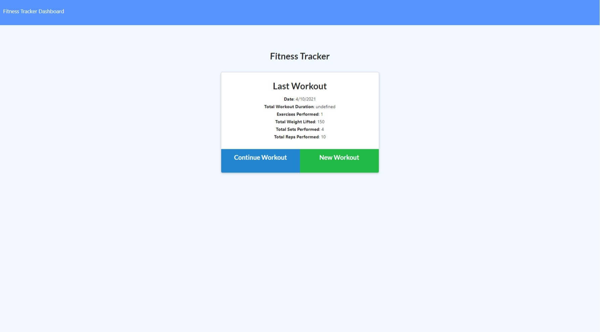
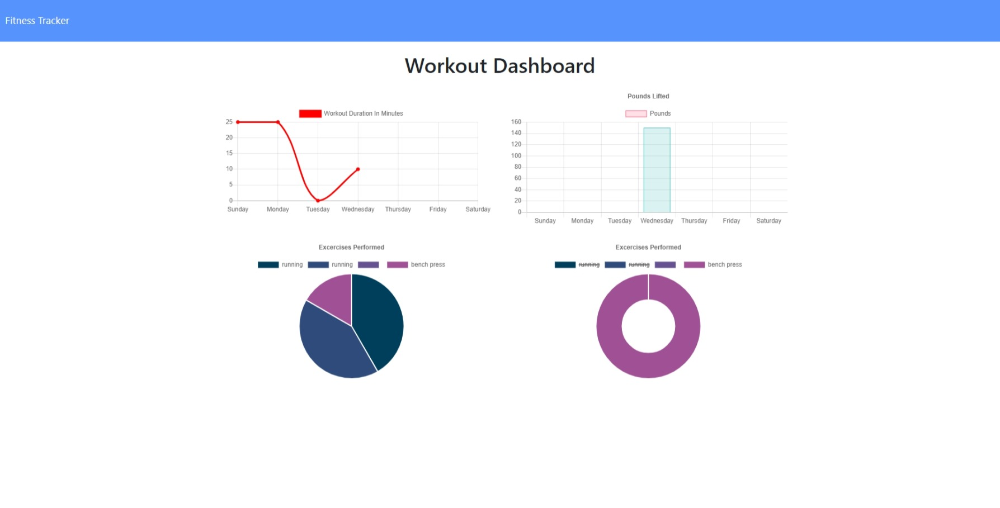

# Unit 17 Nosql Homework: Workout Tracker
# Fitness tracker app

## Deployment
* https://enigmatic-everglades-31612.herokuapp.com/?id=605fc606b05d6500154981a7

## Installation 
* to run this app simply do an npm i in your command window

### Usage 
track workouts with this app, keeps track of reps, cardio and so much more!
as the user it also keeps a detailed graph of all the excersise the user has accomplished.

## ScreenShot

